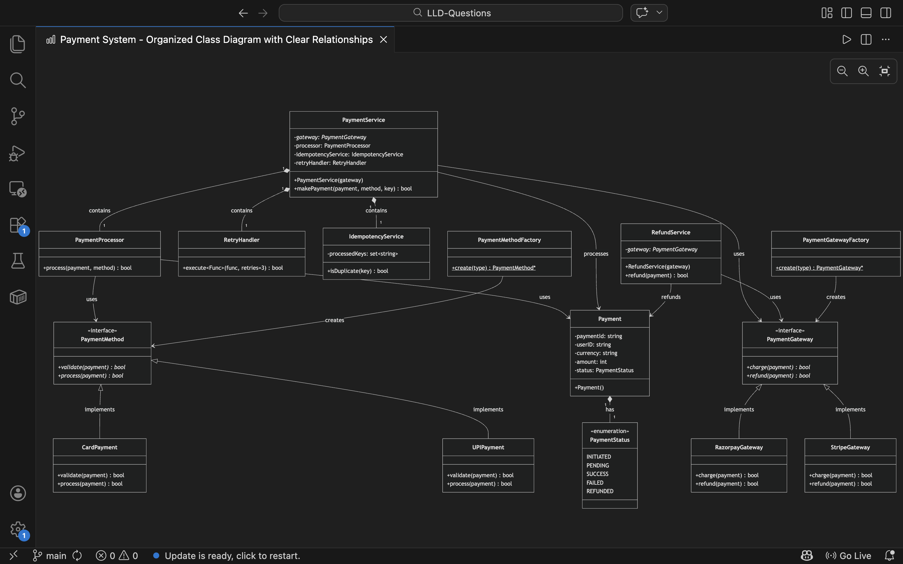

# Payment System - Low Level Design Thinking Process

## 🧠 The Mental Algorithm for LLD (Memorize This)

Whenever you face ANY LLD problem, follow this 9-step process:

## 🪜 Step 1: Extract Nouns → Entities

**From the problem statement:**
- "Payment Gateway" (mentioned in requirements)

**You think:** "Let me identify the core entities first."

**Extract:**
- Payment
- User
- Order
- PaymentMethod
- PaymentGateway

**✅ Rule: Start with data model first**

**First code you write:**
```cpp
class Payment {
    string paymentId;
    double amount;
    PaymentStatus status;
};
```

## 🪜 Step 2: Identify Actions → Responsibilities

**Now ask:** "What operations happen in the system?"

**Answer:**
- Process payment
- Validate payment
- Call external gateway
- Refund

**You say:** "Let me assign responsibilities to components."

## 🪜 Step 3: Identify Variability (KEY STEP)

**👉 This is where design begins.**

**Ask:** "What parts of this system can change?"

**Answer:**
- Payment methods (Card, UPI, Wallet)
- Gateways (Stripe, Razorpay)

**🔥 Say this:** "Since these vary, I should abstract them."

## 🪜 Step 4: Create Interfaces (THIS LEADS TO CODE)

**For Payment Method:**
```cpp
class PaymentMethod {
public:
    virtual bool process(Payment&) = 0;
};
```

**For Gateway:**
```cpp
class PaymentGateway {
public:
    virtual bool charge(Payment&) = 0;
};
```

**👉 You didn't "invent" this — You derived it from variability**

## 🪜 Step 5: Add Concrete Implementations

**Now you say:** "Let me create concrete implementations."

```cpp
class CardPayment : public PaymentMethod {};
class UPIPayment : public PaymentMethod {};

class RazorpayGateway : public PaymentGateway {};
```

## 🪜 Step 6: Identify Orchestration (WHO CONTROLS FLOW?)

**Ask:** "Who is coordinating everything?"

**👉 Answer: PaymentService**

```cpp
class PaymentService {
public:
    bool makePayment(Payment&, PaymentMethod*, PaymentGateway*);
};
```

## 🪜 Step 7: Write Flow Inside Orchestrator

**Now derive logic:**

```cpp
bool makePayment(...) {
    method->process(payment);
    gateway->charge(payment);
}
```

**👉 This is your core logic**

## 🪜 Step 8: Add Real-World Constraints

**Now level up your design.**

**Ask:** "❓ What can go wrong?"

1. **Duplicate request** → Add Idempotency
```cpp
class IdempotencyService {};
```

2. **Gateway failure** → Add Retry
```cpp
class RetryHandler {};
```

3. **Invalid state** → Add PaymentStatus
```cpp
enum PaymentStatus { INITIATED, PENDING, SUCCESS, FAILED };
```

## 🪜 Step 9: Refactor into Clean Structure

**Now organize:**

- **Models** → Payment
- **Strategy** → PaymentMethod
- **Adapter** → Gateway
- **Service** → Orchestrator
- **Utils** → Retry, Idempotency

**👉 This becomes your final LLD**

---

## 🎯 Final Implementation

Based on the above thinking process, here's the complete Payment System:

### Core Data Model
```cpp
enum class PaymentStatus {
    INITIATED, PENDING, SUCCESS, FAILED, REFUNDED
};

class Payment {
    string paymentId;
    string userID;
    string currency;
    int amount;
    PaymentStatus status;
};
```

### Strategy Pattern: Payment Methods
```cpp
class PaymentMethod {
public:
    virtual bool validate(Payment&) = 0;
    virtual bool process(Payment&) = 0;
};

class CardPayment : public PaymentMethod {
    bool validate(Payment&) override;
    bool process(Payment&) override;
};

class UPIPayment : public PaymentMethod {
    bool validate(Payment&) override;
    bool process(Payment&) override;
};
```

### Strategy Pattern: Payment Gateways
```cpp
class PaymentGateway {
public:
    virtual bool charge(Payment&) = 0;
    virtual bool refund(Payment&) = 0;
};

class RazorpayGateway : public PaymentGateway {
    bool charge(Payment&) override;
    bool refund(Payment&) override;
};

class StripeGateway : public PaymentGateway {
    bool charge(Payment&) override;
    bool refund(Payment&) override;
};
```

### Supporting Services
```cpp
class PaymentProcessor {
    bool process(Payment&, PaymentMethod*);
};

class IdempotencyService {
    bool isDuplicate(const string& key);
};

class RetryHandler {
    template<typename Func>
    bool execute(Func func, int retries = 3);
};
```

### Primary Services (Orchestrators)
```cpp
class PaymentService {
    PaymentGateway* gateway;
    PaymentProcessor processor;
    IdempotencyService idempotencyService;
    RetryHandler retryHandler;

public:
    PaymentService(PaymentGateway* g) : gateway(g) {}

    bool makePayment(Payment& payment, PaymentMethod* method, string key) {
        // Step 1: Idempotency check
        if(idempotencyService.isDuplicate(key)) return false;

        // Step 2: Process payment
        if(!processor.process(payment, method)) return false;

        // Step 3: Call external gateway with retry
        bool success = retryHandler.execute([&]() {
            return gateway->charge(payment);
        });

        payment.status = success ? PaymentStatus::SUCCESS : PaymentStatus::FAILED;
        return success;
    }
};

class RefundService {
    PaymentGateway* gateway;
public:
    RefundService(PaymentGateway* g) : gateway(g) {}

    bool refund(Payment& payment) {
        if(payment.status != PaymentStatus::SUCCESS) return false;
        bool success = gateway->refund(payment);
        if(success) payment.status = PaymentStatus::REFUNDED;
        return success;
    }
};
```

### Factory Pattern
```cpp
class PaymentMethodFactory {
public:
    static PaymentMethod* create(const string& type) {
        if(type == "CARD") return new CardPayment();
        if(type == "UPI") return new UPIPayment();
        return nullptr;
    }
};

class PaymentGatewayFactory {
public:
    static PaymentGateway* create(const string& type) {
        if(type == "RAZORPAY") return new RazorpayGateway();
        if(type == "STRIPE") return new StripeGateway();
        return nullptr;
    }
};
```

## 📁 File Structure

```
Design Payment System/
├── Payment.h                 # Core payment data model
├── PaymentMethod.h          # Strategy interface & implementations
├── PaymentGateway.h         # Gateway interface & implementations
├── PaymentProcessor.h       # Payment validation and processing
├── IdempotencyService.h     # Duplicate request detection
├── RetryHandler.h           # Retry logic with templates
├── PaymentService.h         # Main payment orchestration
├── RefundService.h          # Refund processing service
├── Factory.h                # Factory implementations
├── main.cpp                 # Example usage
├── image.png                # Architecture diagram
└── README.md               # This file
```

## 🚀 Usage Example

```cpp
int main() {
    // Create payment
    Payment payment("p1", "u1", "INR", 5000);

    // Create payment method using factory
    PaymentMethod* method = PaymentMethodFactory::create("UPI");

    // Create gateway using factory
    PaymentGateway* gateway = PaymentGatewayFactory::create("RAZORPAY");

    // Create payment service
    PaymentService paymentService(gateway);

    // Process payment with idempotency key
    bool result = paymentService.makePayment(payment, method, "unique_key_123");

    // Check payment status
    cout << "Payment Status: " << (int)payment.status << endl;

    // Refund if needed
    RefundService refundService(gateway);
    refundService.refund(payment);

    return 0;
}
```

## 🎨 Design Patterns Used

1. **Strategy Pattern** - Payment methods and gateways
2. **Factory Pattern** - Object creation
3. **Template Method** - Retry logic
4. **Dependency Injection** - Constructor injection
5. **Composition** - Service composition

## 🏗️ Architecture Diagram



---

**💡 Key Insight:** Good LLD comes from systematic thinking, not random creativity. Follow the 9-step mental algorithm for consistent, high-quality designs!