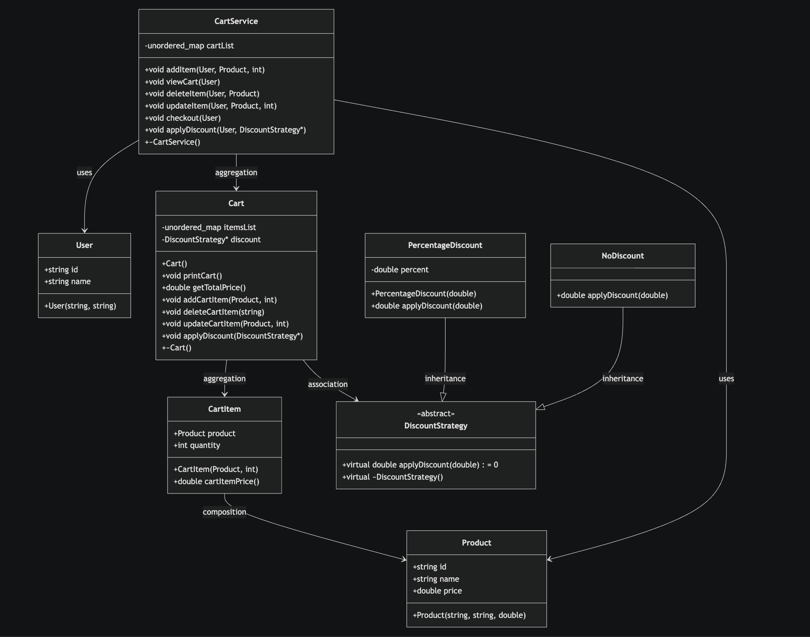

# Shopping Cart System Design

## Class Diagram

## ✅ 1. Requirements

### Functional Requirements
- Add item to cart
- Remove item from cart
- Update quantity
- View cart
- Apply discount
- Checkout

### Non-Functional
- Low latency (cart ops should be fast)
- High availability
- Consistency (important during checkout)
- Scalability (millions of users)

### 👉 Assumptions:
- One cart per user
- Guest cart? (optional — mention but skip if time constrained)
- Inventory check? (defer to checkout - not implemented in this version)

## ✅ 2. Identify Core Entities

Main Entities:
- User
- Product
- Cart
- CartItem
- DiscountStrategy (for discounts/coupons)

## ✅ 3. Define Responsibilities (CRUCIAL for SDE2)

This is where most candidates fail — focus on behavior, not just classes.

| Entity | Responsibility |
|--------|---------------|
| Cart | Manage items, calculate total price, apply discounts |
| CartItem | Hold product + quantity, calculate item price |
| Product | Store price, metadata (id, name) |
| DiscountStrategy | Apply discount logic (percentage discount implemented) |
| CartService | Business logic, manage user carts |
| User | User identification |

## ✅ 4. Relationships
- User → 1 Cart (managed by CartService)
- Cart → multiple CartItems
- CartItem → 1 Product
- Cart → 1 DiscountStrategy (optional)

## ✅ 5. Design Patterns

- **Strategy Pattern** → Discounts / Coupons (DiscountStrategy abstract class with concrete implementations like PercentageDiscount)

## 🔄 7. End-to-End Flow

1. User calls CartService.addItem(user, product, quantity)
2. CartService checks if user has a cart, creates one if not
3. Cart.addCartItem() adds or updates the CartItem
4. For checkout: CartService.checkout() calculates total with discount if applied

## ⚡ 8. Edge Cases

- Product price change after adding to cart (not handled - prices are static)
- Inventory out of stock at checkout (not implemented)
- Concurrent updates (multi-device) - not handled, potential race conditions
- Cart expiration (TTL) - not implemented
- Invalid discount application

## 🚀 9. Improvements (Strong Signal)

- Redis caching for carts
- Event-driven updates
- Persistent storage (DB)
- Versioning for concurrency control
- Separate Pricing Service
- Inventory Service integration
- Coupon/Discount validation

## 🎯 How to Deliver in Interview (IMPORTANT)
- Start with requirements (2 mins)
- Entities + relationships (3 mins)
- Core classes (5 mins)
- Write code (10–15 mins)
- Discuss edge cases (3 mins)
- Suggest improvements (2 mins)

## Implementation Notes
This C++ implementation demonstrates:
- Object-oriented design with proper encapsulation
- Strategy pattern for discount flexibility
- Memory management with RAII (destructors clean up resources)
- Hash maps for efficient lookups (unordered_map)
- Separation of concerns (CartService handles business logic, Cart manages items)
