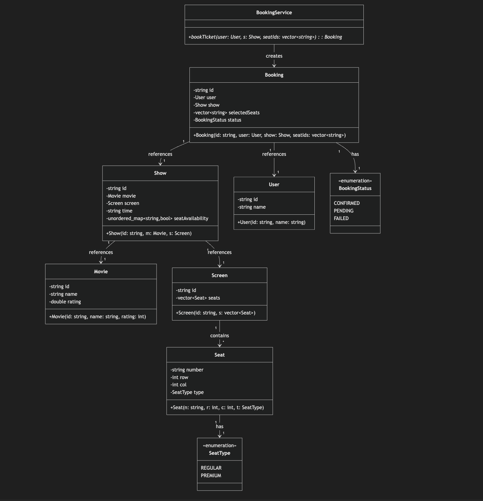

# 🎬 Movie Booking System - Low Level Design (LLD)

## 🧠 Step 1: Clarify Requirements

### ✅ Functional Requirements
Users can:
- View available movies
- Browse shows for selected movies
- Select seats from available inventory
- Book tickets for selected seats
- Cancel existing bookings

System should:
- Prevent double booking of seats
- Handle concurrent booking requests
- Maintain seat availability in real-time
- Track booking status throughout the lifecycle

### ❌ Non-Functional Requirements (Brief Mention)
- **High Concurrency**: Seat booking is the most critical operation
- **Strong Consistency**: No double booking of the same seat
- **Low Latency**: Immediate seat availability updates

---

## 🏗️ Step 2: Identify Core Entities

The system revolves around these eight core entities:

1. **User** - Represents a customer booking tickets
2. **Movie** - Details about a movie (title, rating, etc.)
3. **Screen** - A cinema screen containing multiple seats
4. **Seat** - Individual seat with position and type (Regular/Premium)
5. **SeatType** - Enum defining seat categories
6. **Show** - A specific movie showing at a time on a screen
7. **Booking** - A ticket reservation with selected seats
8. **BookingStatus** - Enum tracking booking lifecycle (Pending, Confirmed, Failed)

---

## 🧩 Step 3: Class Design (Core LLD)

### 1. User
Represents a customer in the system.
- **Attributes**: userId, name
- **Purpose**: Track who is making bookings

### 2. Movie
Stores movie information.
- **Attributes**: movieId, name, rating
- **Purpose**: Allow users to search and view movies

### 3. Screen
Represents a physical cinema screen.
- **Attributes**: screenId, seats (collection of Seat objects)
- **Purpose**: Organize seats and manage screen capacity

### 4. Seat
Represents an individual seat in a screen.
- **Attributes**: seatNumber, row, column, seatType (REGULAR/PREMIUM)
- **Purpose**: Define seat properties and types

### 5. SeatType
Enumeration for categorizing seats.
- **Values**: REGULAR, PREMIUM
- **Purpose**: Enable different pricing and availability tracking

### 6. Show
Represents a specific movie showing.
- **Attributes**: showId, movie, screen, seatAvailability (map of seat → availability)
- **Key Concept**: Seat availability is maintained **per show**, not globally
- **Purpose**: Link a movie to a screen and track seat booking status

### 7. Booking
Records a customer's ticket reservation.
- **Attributes**: bookingId, user, show, selectedSeats, status
- **Status Values**: PENDING → CONFIRMED or FAILED
- **Purpose**: Maintain audit trail of all bookings

### 8. BookingStatus
Enumeration for booking lifecycle.
- **Values**: CONFIRMED, PENDING, FAILED
- **Purpose**: Track the state of each booking

---

## ⚙️ Step 4: Core Services (VERY IMPORTANT)

### 🎯 BookingService (Heart of the System)
The central service that handles seat allocation and booking logic.

**Key Responsibilities:**
1. Check seat availability
2. Lock seats to prevent race conditions
3. Mark seats as unavailable
4. Create booking records
5. Handle booking failures and release locks

**Critical Features:**
- Validates selected seats exist and are available
- Prevents double-booking through locking mechanism
- Maintains seat availability map per show
- Creates atomic booking transactions

**Why This Service is Critical:**
Since multiple users can attempt to book the same seat simultaneously, this service must handle concurrency safely. It's the bottleneck where consistency is enforced.

---

## 🔥 Step 5: Concurrency Handling (CRITICAL)

### The Problem:
Multiple users selecting the same seat at the exact same time creates a race condition.

### Solutions Discussed:

**1. Pessimistic Locking (Used in this system)**
- Lock seats immediately when booking attempt starts
- Prevents other users from accessing locked seats
- Release lock only after booking confirms or fails
- **Advantage**: Simple, guarantees consistency
- **Disadvantage**: Higher latency, reduced throughput

**2. Optimistic Locking (Alternative)**
- Check version number before committing booking
- Retry if version mismatch detected
- **Advantage**: Better throughput in low-conflict scenarios
- **Disadvantage**: More complex retry logic

**3. TTL-based Locking (Production Approach)**
- Lock expires automatically after timeout (e.g., 5 minutes)
- Prevents deadlocks from abandoned operations
- Used with distributed systems like Redis
- **Advantage**: Handles system failures gracefully
- **Disadvantage**: Requires external infrastructure

---

## 🧠 Step 6: System Architecture

### Data Flow:

1. **Movie Selection** → User views available movies
2. **Show Browsing** → User selects shows for chosen movie
3. **Seat Display** → System shows available/unavailable seats per show
4. **Seat Locking** → User clicks "Book" and system locks selected seats
5. **Availability Check** → System validates all seats are still available
6. **Status Update** → Mark seats unavailable in show's availability map
7. **Booking Creation** → Create booking record with CONFIRMED status
8. **Confirmation** → Display booking details to user

### Core Classes Interaction:

---

## 🔁 Step 7: Booking Flow (Detailed)

**Happy Path:**
1. User provides userId, show, and list of seatIds
2. BookingService locks the requested seats
3. Service checks if all seats are available
4. Service marks seats as unavailable
5. Service creates booking with CONFIRMED status
6. Return booking details to user

**Failure Path:**
1. If any seat is already booked → unlock seats → return FAILED status
2. If lock acquisition fails → user retries booking

---

## ⚡ Step 8: Future Improvements (SDE2+ Signal)

### 1. Seat Hold Feature
- Reserve seats for 5-10 minutes without charging
- Auto-release if user doesn't confirm
- Improves user experience

### 2. Waitlist System
- Queue users when all seats sold out
- Notify when cancellations occur
- Fair allocation mechanism

### 3. Dynamic Pricing
- Adjust seat prices based on demand
- Premium pricing for last-minute bookings
- Discount pricing for advance bookings

### 4. Caching Strategy
- Cache movie and show data (rarely changes)
- Cache seat availability with short TTL
- Use Redis for distributed locking

### 5. Database Sharding
- Shard shows by theatre ID
- Reduce lock contention
- Improve scalability

### 6. API Endpoints (Optional but Strong Signal)
- `GET /movies` - List all movies
- `GET /shows?movieId=<id>` - Get shows for a movie
- `GET /shows/<showId>/seats` - Get seat layout
- `POST /booking` - Create booking
- `POST /booking/<bookingId>/cancel` - Cancel booking

---

## 📊 Class Diagram Summary

The system consists of 8 interconnected classes:
- **Enums**: SeatType (REGULAR, PREMIUM), BookingStatus (PENDING, CONFIRMED, FAILED)
- **Entities**: User, Movie, Screen, Seat, Show, Booking
- **Service**: BookingService

Show is the central hub that links Movie, Screen, and manages seat availability per viewing. BookingService orchestrates the booking logic and handles concurrency.

---

## 🎯 Key Takeaways

1. **Consistency First**: Seat booking is critical; design around preventing race conditions
2. **Per-Show State**: Availability is tracked per show, enabling concurrent bookings for different shows
3. **Atomic Operations**: Locking ensures all-or-nothing booking semantics
4. **Service Layer**: BookingService isolates complex booking logic
5. **Extensibility**: Design allows easy addition of payments, waitlists, and pricing logic
